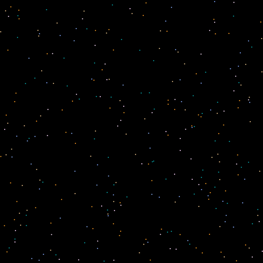
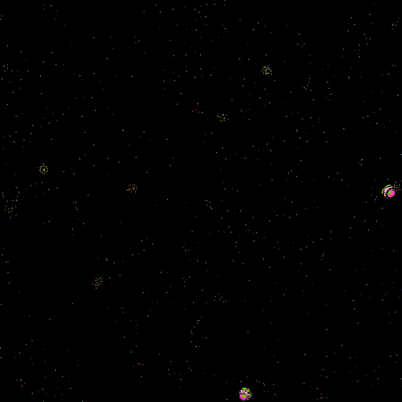

# Particles
A particle simulation with randomized rules.

## Usage

Edit config.ron to configure.

Keys:
```
[Space] - Play/Pause
[F]     - One frame forward
[Esc]   - Close
```

## Building and Running

### Requirements
* Git
* The Rust toolchain
* SDL2 and SDL2-gfx development libraries (see bellow)

### Install SDL2 libraries (Ubuntu)
```bash
sudo apt install libsdl2-dev libsdl2-gfx-dev
```

### Clone, Compile and Run
```bash
git clone https://github.com/AugLuk/particles.git
cd particles
cargo run --release
```

## Samples





